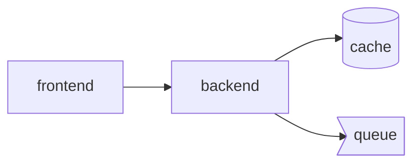

# Radius App Graph Diff Action

A GitHub Action that compares Radius application graphs between branches and posts visual diff comments on pull requests.

## Overview

When you commit `.radius/app-graph.json` files alongside your Bicep source code, this action automatically:

1. Detects app graph files changed in the PR
2. Computes the diff between base and head branches
3. Posts a formatted comment showing:
   - Added/removed/modified resources
   - Connection changes
   - Before/after Mermaid topology diagrams

## Quick Start

Add this workflow to your repository (`.github/workflows/app-graph-diff.yml`):

```yaml
name: App Graph Diff

on:
  pull_request:
    paths:
      - '**/.radius/app-graph.json'

permissions:
  pull-requests: write
  contents: read

jobs:
  diff:
    runs-on: ubuntu-latest
    steps:
      - uses: actions/checkout@v4
        with:
          fetch-depth: 0

      - uses: radius-project/radius/actions/app-graph-diff@main
        with:
          github-token: ${{ secrets.GITHUB_TOKEN }}
```

## Inputs

| Input | Required | Default | Description |
|-------|----------|---------|-------------|
| `github-token` | Yes | `${{ github.token }}` | GitHub token with `pull-requests: write` permission |
| `graph-path` | No | `.radius/app-graph.json` | Path to the app graph file |
| `base-ref` | No | PR base SHA | Base ref for comparison |
| `head-ref` | No | PR head SHA | Head ref for comparison |
| `fail-on-stale` | No | `false` | Fail if graph is out of sync with Bicep files |
| `include-mermaid` | No | `true` | Include Mermaid diagrams in comment |
| `comment-header` | No | `<!-- radius-app-graph-diff -->` | HTML comment marker for identifying comments |
| `monorepo-glob` | No | ` ` | Glob pattern for monorepo support |

## Outputs

| Output | Description |
|--------|-------------|
| `has-changes` | Whether any graph changes were detected (`true`/`false`) |
| `added-count` | Number of resources added |
| `removed-count` | Number of resources removed |
| `modified-count` | Number of resources modified |
| `diff-json` | JSON representation of the diff |

## Example PR Comment

When changes are detected, the action posts a comment like:

---

### 📊 App Graph Diff

| Change Type | Count |
|-------------|-------|
| ➕ Added | 2 |
| ➖ Removed | 0 |
| 📝 Modified | 1 |

<details>
<summary>Added Resources</summary>

| Name | Type |
|------|------|
| cache | Applications.Datastores/redisCaches |
| queue | Applications.Messaging/rabbitMQQueues |

</details>

<details>
<summary>Topology</summary>



</details>

---

## Monorepo Support

For monorepos with multiple applications, use the `monorepo-glob` input:

```yaml
- uses: radius-project/radius/actions/app-graph-diff@main
  with:
    github-token: ${{ secrets.GITHUB_TOKEN }}
    monorepo-glob: 'apps/**/.radius/app-graph.json'
```

This finds all matching graph files and processes them individually.

## Staleness Validation

To ensure committed graphs stay in sync with source Bicep files:

```yaml
- uses: radius-project/radius/actions/app-graph-diff@main
  with:
    github-token: ${{ secrets.GITHUB_TOKEN }}
    fail-on-stale: 'true'
```

This compares the committed graph's `sourceHash` against a freshly computed hash from the source files. If they differ, the action fails with instructions to regenerate.

## Workflow Triggers

### Pull Request (Recommended)

Post comments on PRs that change app graphs:

```yaml
on:
  pull_request:
    paths:
      - '**/.radius/app-graph.json'
```

### Push

Track changes on push to main (for baseline tracking):

```yaml
on:
  push:
    branches:
      - main
    paths:
      - '**/.radius/app-graph.json'
```

## Permissions

The action requires:
- `pull-requests: write` - To post/update PR comments
- `contents: read` - To read graph files from git history

## Generating App Graphs

Use the Radius CLI to generate app graphs:

```bash
# Generate graph from Bicep file
rad app graph app.bicep

# Output: .radius/app-graph.json
```

See the [Radius documentation](https://docs.radapp.io) for more details.

## Customizing the Comment

The `comment-header` input is an HTML comment used to identify existing comments for updates. If you run multiple instances of this action (e.g., for different apps in a monorepo), use different headers:

```yaml
- uses: radius-project/radius/actions/app-graph-diff@main
  with:
    github-token: ${{ secrets.GITHUB_TOKEN }}
    graph-path: 'apps/frontend/.radius/app-graph.json'
    comment-header: '<!-- radius-graph-diff-frontend -->'
```

## Troubleshooting

### "No graph changes detected"

The action only processes files that changed between the base and head refs. Ensure:
1. The graph file exists in both branches
2. The file content actually differs

### "Permission denied"

Ensure your workflow has the required permissions:

```yaml
permissions:
  pull-requests: write
  contents: read
```

### "Shallow clone" warnings

The action needs full git history to compare refs. Use:

```yaml
- uses: actions/checkout@v4
  with:
    fetch-depth: 0  # Full history
```

## License

Apache License 2.0 - See [LICENSE](../../LICENSE) for details.
